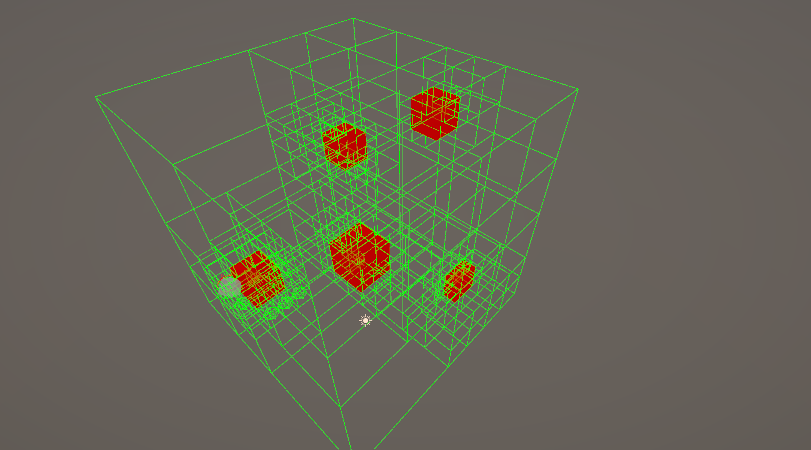
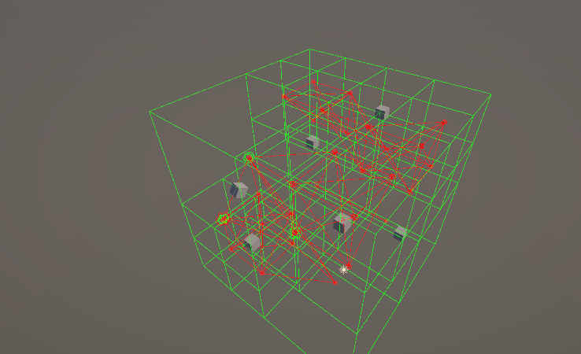

### 3D Navigation space generation using Octrees!

## Introduction
I'm Yannick, a student at Howest following Game Development. For one of the assignments, we had to pick a topic and research/implement it.
The topic I've chosen is **3D Navigation Space Generation Using Octrees**. This repo is entirely dedicated to the research of this topic.

## What are Octrees
To make it easier to understand octrees, I'll first explain the origin. Tree structures! If you've never seen a tree structure before, this is what it looks like.


As you can see, every tree has **ONE** root node. It is the node where the tree starts. Each node inside a tree can also have any amount of children nodes. You can see in the example that Node A, the root node, has 2 children (node B and node C). Node E and node F are in their turn node C's children. Now who is/are node B's children... ? If you've answered D, you're correct. There are 2 last important things to know about tree structures. A tree structure has leaf nodes. Leaf nodes are nodes that have no children at all. In our example being nodes D, E and F. The last property is that each node has 1 parent node (except for the root node).

Let's go 1 step closer to octrees. Enter **Quadtrees**!
Here's an example


As you can see in this example, each node has exactly 4 or no children. That special thing about a quadtree. All children in a quadtree have either no or 4 children.

The octree is in definition as easy as a quadtree. It's a tree structure where every node has either no or exactly 8 children.
This is what it looks like.


## Why would we use them?
"Why would this ever be useful at all?", you might be wondering. Well octrees are used in quite a few different topics. It's used for accelerating rendering, checking collisions, storing geographical data,... . What I currently will be using it for is spatial partitioning. 
Once again, I'll start with quadtrees to make it easier to understand. 
Let's say you're making some kind of algorithm that simulates a big crowd of people moving in a direction without ever making contact (or just flocking). What would you need for this? Let's start with 1 person, his name will be John. He's in a room with 100 people. You want to know the location of every person within a radius of 1 meter from John. We do this so John knows how to continue moving without hitting someone else.


John is our red point here and we want to know who currently can be found in John's radius. Right now we would have to check every single person in that room and calculate the distance to John to see if they fall within John's radius. Doing this is terribly inefficient! You might be thinking, "I've done this before with 100 people and it worked perfectly fine". First of all, this might work if it's the only thing you do. But imagine that there's an entire game running while you do this. It would calculate and compare 100 different distances each frame while the rest still has to work well on 60fps. Unless you want to make the requirements of the game scare off about half its fanbase, you will probably need to do some optimizations there. Luckily this is where spatial partitioning comes in play. Let's start by dividing our room into a couple of grids.


Now some of you might already have noticed something seeing this image, and you're correct. The radius of John only goes into his current grid and the one next to it. This means we only need to take the people who are in neighboring grids into account. This is already a huge optimization! We went from checking every person in the room, to checking only the ones that are in the same or neighboring grids. 
"I'll just make each grid as small as possible so I have to check even less people!", and this idea could work. The only issue is that before we start calculating with the people in the neighboring grids, we need to know who the neighboring grids are. If you decide to split up your room into 100 grids, your algorithm will actually be slower than the gridless one. You need to do the neighbor check for 100 grids and then also calculate distances to the people within those neighboring grids. This will slow your program a lot. "Well I'll just save each grid's neighbor so I don't have to calculate them every frame.", and this is not a bad idea and for some games will do the job. But right now the problem is that you're using a lot of memory and even still, some grids have no people inside them so it's wasted precision. We want to have a solution where you have as few people per grid but also as few grids as possible. This is where quadtrees come in. Let's start with a simple example!


In this example, we put 6 players in a simple room. In a quadtree, each internal node has exactly 4 children (or none), so let's divide our room into 4!


Right now, the grids on the right have 1 player per grid. This is what we want! The left grids on the other hand still have 2 players per grid. Let's subdivide again. Just like before, we divide each of those grids into 4 again.


Now we've succesfully divided our grid into smaller grids only where needed keeping the empty grids to a minimum! This is the base concept of using quadtrees for spatial partitioning. I'm leaving out some details on purpose like the fact that the players won't stay still and we would need some kind of optimized recalculation, but those are topics for another time. 
To get to the actual topic of this repo, **Octrees**! Now that you know what quadtrees are, it's really easy.
Octrees are just quadtrees but then in 3D!


Instead of checking if there is a player within a square, we check if there's a player within a cube. If there is a player within the cube, we subdivide that cube into 8 equal smaller cubes. It works exactly the same as quadtrees but instead it's a 3D version!

## Implementation Time!
The people who came here for just theory can now close this tab and enjoy the rest of their days. For the others, I'll now go into details of how I did it. This project was made in Unity, thus all of my code examples will be in C#. I followed the youtube tutorial mentioned in the sources as the base of my octree generator. You could simply follow the tutorial yourself to get started, but I'll explain it here too.

# Bounding box generation
The bounding box is the start of any octree. We need to know the starting extents of all objects that we want to include. The code for this part was pretty simple. I just get all of the object's bounding boxes and encapsulate them into 1 big box.
````c#
void CalculateBounds(List<GameObject> objects) {
    foreach (var obj in objects) {
        Bounds.Encapsulate(obj.GetComponent<Collider>().bounds);
    }
}
````

Part 1 done! The only thing we're still lacking is that an octree always is a cube. Let's add a 2 lines to make sure we're converting the bounds into a cube.
````c#
void CalculateBounds(List<GameObject> objects) {
    foreach (var obj in objects) {
        Bounds.Encapsulate(obj.GetComponent<Collider>().bounds);
    }

    Vector3 size = Vector3.one * Mathf.Max(Bounds.size.x, Bounds.size.y, Bounds.size.z) * 0.6f;
    Bounds.SetMinMax(Bounds.center - size, Bounds.center + size);
}
````

We started out by calculating the dimension with the biggest size. We then take that value and apply it on all axis and calculate the min and max value of the bounds using this size. Notice that we do 0.6f instead of 0.5f to give us  a bit more room to play with.

# Subdividing 
Wow! We're already done with the first part of creating an octree. In general, octrees are not that hard to make. It's a bigger challenge to make them really efficient for dynamic octrees. Let's start with the subdivision. We need 2 pieces of information for the subdivision. We need the objects to include and the min node size. The minimum node size decides the level of details that the octrees will have. Choosing a lower number will end up making smaller nodes, which results in more accurate octrees. The downside is that this is exponentially more expensive to do, both memory and performance wise. For this part, we created an OctreeNode class. The first thing we're going to do is create our root OctreeNode.
````c#
private void CreateTree(List<GameObject> objects, float minNodeSize) {
    Root = new OctreeNode(Bounds, minNodeSize);
}
````
This will be the starting point of our octree. The next thing to do is add the objects one by one to the octree. For this I created a method called divide inside the OctreeNode class.

````c#
public void Divide(OctreeObject octObj) {
    //check if we're not making nodes too small
    if (bounds.size.x <= _minNodeSize) {
        AddObject(octObj);
        return;
    }
}
````

We start by checking our current bounds size. If our node is smaller than the minimum, we can stop with subdividing. Next we need to subdivide our node into 8 child-nodes. I'll call these children. 

````c#
//previous code...
for (int i = 0; i < 8; i++) {
    children[i] ??= new OctreeNode(_childBounds[i], _minNodeSize);
    if (octObj.Intersects(_childBounds[i])) {
        children[i].Divide(octObj);
    }
}
````
We currently check if any of my children intersect with the bounds of the object to add. If they do, we on their turn divide that node. **Recursions!** Now that we have our division function, we can start using it.
Let's go back to the original code that created the tree and use our freshly created function.
````c#
private void CreateTree(List<GameObject> objects, float minNodeSize) {
    Root = new OctreeNode(Bounds, minNodeSize);
    foreach (var obj in objects) 
    {
        Root.Divide(obj);
    }
}
````
Congratulations! You've created your first octree and are wondering how it is this easy. What we currently created is an octree that gets created once and does not change. The real difficulty starts when trying to make it dynamic.

# Adding objects
Let's start with adding objects. From this point on, we're going further than the original tutorial. I do still recommend watching it as it also implements A* on the octree. 
We first tackle the easiest part of adding an object. Adding an object that's within the bounds of the original octree. We do not need any new functionality to implement this!
````c#
public void AddObject(OctreeObject obj)
{
  Root.Divide(obj);
}
````

Can you spot the issue? There's actually 2. The first issue is efficiency. We currently take our bounds, and starting with the roots, we divide our entire octree again. This is can be optimized. Let's add a bit of functionality to make this more efficient. We only want to divide the OctreeNodes that are in contact with our object. To do this, we simply create a function that looks for the smallest node that completely encompasses the object. 
````c#
private OctreeNode GetSmallestContainingNode(OctreeObject obj)
{
    var current = Root;
    var previous = current;
    while(true)
    {
        previous = current;
        //if there are no children, we are already at the smallest possible node for this region
        if (current.children == null) break;

        //go over all the children and check which one fully contains the object
        for(int i = 0; i < 8; i++)
        {
            //sanity check
            if (current.children[i] == null) continue;

            if (current.children[i].bounds.Contains(obj.bounds.min) && current.children[i].bounds.Contains(obj.bounds.max))
            {
                current = current.children[i]; 
                break;
            }
        }

        //if we have not found a child octant that contains the entire object, we break
        if(previous == current) break;
    }

    return current;
}
````

The code does the following: we take our root, and we get all of it's children. We now check if any of the children fully encompasses the object. If we find one, we use it for our next loop and do the same. We continue this process until we can't find any children that can completely encompass the object. We now know that there will only be changes inside that last node we found. We can use this in our original function like this.
````c#
public void AddObject(OctreeObject obj)
{
  var smallestContainingNode = GetSmallestContainingNode(obj);
  smallestContainingNode.Divide(obj);
}
````

"I have a fully dynamic octree... YEEAHHH...", will be going through someone's mind right now (and they're wrong). There is currently still a huge problem with this code. What happens if our object is outside of the tree? Some will probably have the reflex to reconstruct the octree completely, and it would work. The issue is that it would be REALLY REALLY slow. We want to be able to add objects with a snap of our fingers whenever we want. If we completely reconstruct if whenever we add an object outside of our bounds, it would slow down everything **A LOT**. Luckily there's an easy solution. Instead of recreating the entire thing, we just make the current root a child of a bigger octree we make. Let's first start by checking we need to expand our octree.
````c#
public void AddObject(OctreeObject obj)
{
    var bounds = obj.bounds;
    //check if we need to expand the octree
    if (Root.bounds.Contains(bounds.min) && Root.bounds.Contains(bounds.max))
    {
        var smallestContainingNode = GetSmallestContainingNode(obj);
        smallestContainingNode.Divide(obj);
    }
}
````

We can then start by expanding our tree if the obj does not fully appear inside of the octree.

```` c++
//previous code

else
{
    var outOfBoundsPos = bounds.center;
    OctreeNode[] newChildren = new OctreeNode[8];
    newChildren[0] = Root;
    
    Vector3 offsets = new();
    offsets.x = outOfBoundsPos.x < Root.bounds.center.x ? -Root.bounds.size.x : Root.bounds.size.x;
    offsets.y = outOfBoundsPos.y < Root.bounds.center.y ? -Root.bounds.size.y : Root.bounds.size.y;
    offsets.z = outOfBoundsPos.z < Root.bounds.center.z ? -Root.bounds.size.z : Root.bounds.size.z;
    for (int i = 1; i < 8; i++)
    {
    Vector3 currentCenter = new();
    //switches every loop between an x offset and no x offset
    currentCenter.x = Root.bounds.center.x + ((i & 1) == 0 ? 0 : offsets.x);
    //switches every 2 loop1 between an y offset and no y offset
    currentCenter.y = Root.bounds.center.y + ((i & 2) == 0 ? 0 : offsets.y);
    //switches every 4 loop between an z offset and no z offset
    currentCenter.z = Root.bounds.center.z + ((i & 4) == 0 ? 0 : offsets.z);
    
    Bounds currentBounds = new(currentCenter, Root.bounds.size);
    newChildren[i] = new OctreeNode(currentBounds, _minNodeSize);
    //we divide it if needed
    if (newChildren[i].bounds.Intersects(bounds))
        newChildren[i].Divide(obj); 
    }
    
    //don't need to call divide on this since this already hasd the 8 children in which divide would split it 
    //and i'm already only dividing the children if needed
    Root = new OctreeNode(newChildren, _minNodeSize);
}
````
We first calculate in what direction we're supposed to expand and based on that, we calculate our offsets in each dimension. Our current root can be our first child so we only need to create 7 more children. I do some bitwise operations to make sure we create a node in all possible other positions. We now only check if the object intersects with the currently being created note, and if it does, we divide that node. The last thing we do is change the root to be a parent of all the newly created nodes.
I'm still forgetting 2 things! The first is that we're not handling the scenario where the object is partly inside of our octree. This is a pretty easy (and nasty) fix.

````c#
else
{
    //if at least something is inside the root, we divide
    if (Root.bounds.Contains(bounds.min) || Root.bounds.Contains(bounds.max))
     Root.Divide(obj);
//rest of the original code
````

We simply divide our root first and then do the rest of the original calculations. The second edge case we're not handling is when our object is bigger than our current octree. We would not be able to expand in enough directions to cover the entire object. The fix for this is also really easy. We simply put our code from before in a loop.

````c#
while(!(Root.bounds.Contains(bounds.min) && Root.bounds.Contains(bounds.max)))
//we see what part is outside of the current octree
{
    var outOfBoundsPos = Root.bounds.Contains(bounds.min) ? bounds.max : bounds.min;
    OctreeNode[] newChildren = new OctreeNode[8];
    newChildren[0] = Root;

    Vector3 offsets = new();
    offsets.x = outOfBoundsPos.x < Root.bounds.center.x ? -Root.bounds.size.x : Root.bounds.size.x;
    offsets.y = outOfBoundsPos.y < Root.bounds.center.y ? -Root.bounds.size.y : Root.bounds.size.y;
    offsets.z = outOfBoundsPos.z < Root.bounds.center.z ? -Root.bounds.size.z : Root.bounds.size.z;
    for (int i = 1; i < 8; i++)
    {
        Vector3 currentCenter = new();
        currentCenter.x = Root.bounds.center.x + ((i & 1) == 0 ? 0 : offsets.x);
        currentCenter.y = Root.bounds.center.y + ((i & 2) == 0 ? 0 : offsets.y);
        currentCenter.z = Root.bounds.center.z + ((i & 4) == 0 ? 0 : offsets.z);

        Bounds currentBounds = new(currentCenter, Root.bounds.size);
        newChildren[i] = new OctreeNode(currentBounds, _minNodeSize);
        //we divide it if needed
        if (newChildren[i].bounds.Intersects(bounds))
            newChildren[i].Divide(obj); 
    }

    //don't need to call divide on this since this already hasd  the 8 children in which divide would split it 
    //and i'm already only dividing the children if needed
    Root = new OctreeNode(newChildren, _minNodeSize);
}
````

We do the expending process for as long as our current octree does not contain the entire object. We now have officially completely implemented adding objects. Congrats!
Here's what it looks like.

https://github.com/user-attachments/assets/823555e2-dc94-4ae1-a40f-67dae581c875


# Removing objects
The last part I implemented as part of the dynamic octree is removing objects. This unfortunately comes a couple extra things to think about it.
Before i get into the details, I'll first quickly explain the OctreeObject class. Currently our OctreeObject class i simple

````c#
public class OctreeObject {
    public Bounds bounds;
    public OctreeObject(GameObject obj) {
        if (obj == null){
            bounds = new Bounds();
            bounds.size = Vector3.zero;
            return; 
        }
        bounds = obj.GetComponent<Collider>().bounds;
    }

    public bool Intersects(Bounds other) => bounds.Intersects(other);
};
````
This works for what we had to do. But to be able to implement object removal efficiently, we'll need to add another member. 

````c#
public class OctreeObject {
    public Bounds bounds;
    public List<OctreeNode> ParentNodes = new();
    //rest of the class
}
````
This field will keep track of all the nodes the object currently resides in. One change we now have to make to our existing code is the following.

````c#
public void Divide(OctreeObject octObj) {
    //check if we're not making nodes too small
    if (bounds.size.x <= _minNodeSize) {
        AddObject(octObj);
        octObj.ParentNodes.Add(this);
        return;
    }
    //rest of code
}
````
Whenever we found the final node in which (part of) the object resides, we add ourselves to the ParentNodes list. Let's start with the removal.
Because of this added field, we can already do a really efficient validity check.

````c#
public void RemoveObject(OctreeObject obj)
{
    if(obj.ParentNodes.Count == 0)
    {
        Debug.LogError("This octreeobject is not part of any octants!");
        return;
    }
}
````
If the object has no parentNodes, it's not part of our octree. Next, let's remove ourselves from the object lists in all the ParentNodes.
````c#
public void RemoveObject(OctreeObject obj)
{
    //code from earlier
    foreach (var node in obj.ParentNodes)
    {
        node.RemoveObject(obj);
    }
}
````

So far so good. Now comes the first trickier part. When our nodes are all empty, there is no reason to keep them divided. That's one of the cool features about octrees, they're really memory efficient (if done well). For this we'll have to make a new function inside our OctreeNode class.

````c#
public void TryCollapse()
{
    if (children == null) return;
    
    for(int i = 0; i < children.Length; i++)
    {
        if (!children[i].IsEmpty) return;
    }
    children = null;
    //root node has no parent
    if(ParentNode != null)
        ParentNode.TryCollapse();
}
````
In this function, we see if we can collapse our children nodes (in case they're all empty). I created another field called ParentNode in the OctreeNode class aswell for this purpose. The function is pretty straighforward. If there's no children to begin with, there's no collapsing to do! Then we check all our children. If at least one of them is not empty, we can also return since we can't collapse it if there's a reason to keep it divided. Then at the end, if all the children are empty, we try the same function for our parent.
We can now use this in our object removal.
````c#
public void RemoveObject(OctreeObject obj)
{
    //code from earlier
    foreach (var node in obj.ParentNodes)
    {
        node.RemoveObject(obj);
    }
    foreach (var node in obj.ParentNodes)
    {
        if(node.ParentNode != null)
            node.ParentNode.TryCollapse();
    }
}
````

This takes care of our first issue. The second one is shrinking. In our AddObjects function, we expand our entire octree if the object is out of bounds. Well let's say we want to undo that. We will end up with the huge octree while it's not necessary, with our current code at least. Let's make one last function for our OctreeNode class.
````c#
public OctreeNode TryShrinking()
{
    //we can't collapse without any children
    if (children == null) return this;

    //check how many empty children we have
    int nrNonEmptyChildren = 0;
    int nonEmptyIndex = -1;
    for(int i = 0; i < 8; i++)
    {
        //if we find a non empty child
        if (!children[i].IsEmpty)
        {
            //save its index and increment the counter
            nonEmptyIndex = i;
            nrNonEmptyChildren++;
        }
        //if we have more than 1 non empty child, we can not collapse so we just return the current node (will become new root)
        if (nrNonEmptyChildren > 1) return this;
    }
    //if there's only 1 child non-empty, we see if that child can collapse
    return children[nonEmptyIndex].TryShrinking();
}
````

Let's first go over the theory. When can we shrink our octree? It's when (in the root node) only 1 of the 8 octants has objects inside of it. This is what we check in our function aswell. We first check if we have any children at all, we can't shrink if there's no children to begin with. We then count the amount of child nodes that have an object inside of their bounds. If it's more than 1, we can just return our current node since there's no shrinking possible. If there ends up only being 1 child node with objects, we just do the same thing for that object and return it.
If we now use this too in our object removal.
````c#
public void RemoveObject(OctreeObject obj)
{
    //code from earlier
    foreach (var node in obj.ParentNodes)
    {
        node.RemoveObject(obj);
    }
    foreach (var node in obj.ParentNodes)
    {
        if(node.ParentNode != null)
            node.ParentNode.TryCollapse();
    }
    obj.ParentNodes.Clear();
    Root = Root.TryShrinking();
}
````
Here's the result.


https://github.com/user-attachments/assets/bd33b4e7-e6f7-47cb-8dc2-c0b60c55686d


## Navigation
The last thing I'll explain is how exactly we can use this to navigate. This part is also covered by the tutorial I mentioned earlier. The pathfinding algorithm used to navigate this octree is A*. I won't explain A* itself but rather how we would use it on our octree. If you don't know how it works, I recommend watching the first 4 minutes of the video marked with A* below. Let's start using our A*.
To use A*, we need 2 pieces of information. 
First is all the empty leaf nodes. To get this, you can recursively go over all the nodes and add the empty leaves to a list. But why would we need the leaf nodes to begin with? 



The image shows the difference between filled and non-filled leaf nodes. To have the most accurate octree, we subdivided parts with objects into smaller parts. This means that the leaf nodes represent the most accurate representation of the environment. If we would start using nodes other than the leaf nodes, we would just be throwing away accuracy that we spent time acquiring. We also don't want our drone to be flying 200 meters around a small flag pole which takes up 2 meters. 

The second thing we need is all the connections between the nodes. We can create these after finding all empty leaf nodes. We simply check for each of the empty leaf nodes if they intersect with any of the other leafs nodes. If they do, we create an "edge" that contains both the first and the second node and has a cost which is the distance between them. Here's how the connections would look after tuning down the accuracy a bit and removing some redundant debug drawing.



I gave you the pieces of the puzzle. The rest is up to you.

## Finish
We have a finished (slightly) dynamic octrees! Good job, you now know the basics of octrees and navigating throught it. The topic of dynamic octrees continues to grow. We could optimize our tree by using a combination of loose octrees and temporal coherence, but that's for another time. 
Thank for reading all the way through :)! (also if you decide to do loose octrees, it's not difficult but there's like a total of 4 papers online to read about it so good luck 👍)


## Sources!
# Images
Image 1:
https://simplealgo.org/ 

Image2: 
https://www.mdpi.com/2076-3417/10/21/7636

Image 3:
https://kaolin.readthedocs.io/en/latest/notes/spc_summary.html


# General knowledge
https://www.numberanalytics.com/blog/octrees-ultimate-spatial-data-structure

https://en.wikipedia.org/wiki/Octree

https://en.wikipedia.org/wiki/Quadtree

https://kaolin.readthedocs.io/en/latest/notes/spc_summary.html

https://www.researchgate.net/publication/309526457_INDOOR_A_PATHFINDING_THROUGH_AN_OCTREE_REPRESENTATION_OF_A_POINT_CLOUD

https://www.academia.edu/54040490/OctoMap_An_Efficient_Probabilistic_3D_Mapping_Framework_Based_on_Octrees

https://tsapps.nist.gov/publication/get_pdf.cfm?pub_id=821308


# Tutorial
Octrees:
https://youtu.be/gNmPmWR2vV4

A*:
https://youtu.be/i0x5fj4PqP4
